<div align="center">


### Tus podcasts. Tu biblioteca. A tu ritmo.

Una app gratuita y de código abierto para escuchar tus podcasts favoritos en Android.<br />
Añade tus programas y lleva tus episodios contigo, también sin conexión.

<p>
  
  
  <a href="LICENSE"></a>
</p>

<a href="https://github.com/ByXuXy88/onda/releases/tag/v1.8.1"></a>

[Descargas](https://github.com/ByXuXy88/onda/releases/tag/v1.8.1) · [Informar de un problema](https://github.com/ByXuXy88/onda/issues) · [Contribuir](CONTRIBUTING.md)

**Empieza con la biblioteca vacía. Tú eliges qué podcasts añadir.**

</div>

## Así se ve Onda

| Tus programas | Reproductor completo |
| :---: | :---: |
| 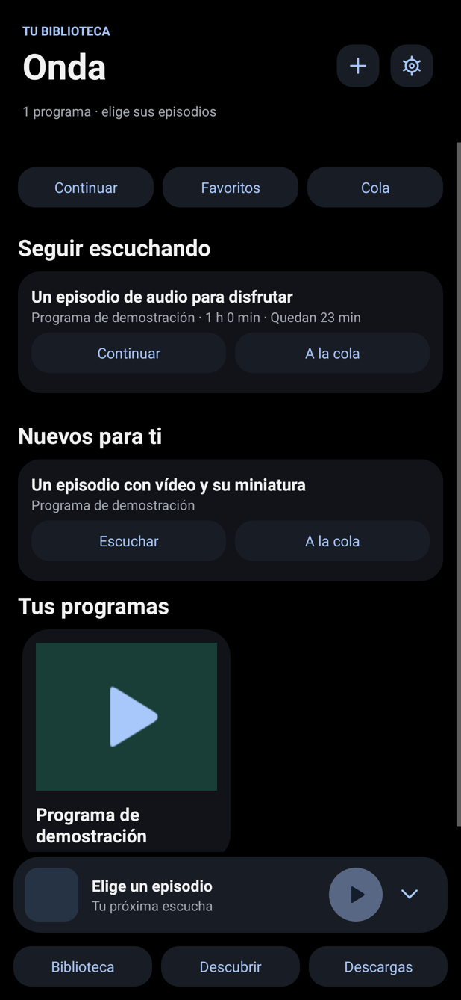 | 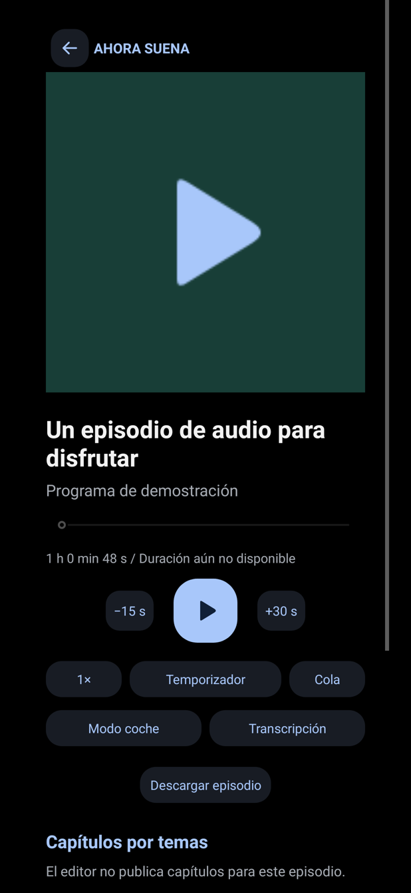 |

| Tu biblioteca | Añade tus podcasts | RSS o Apple Podcasts |
| :---: | :---: | :---: |
| 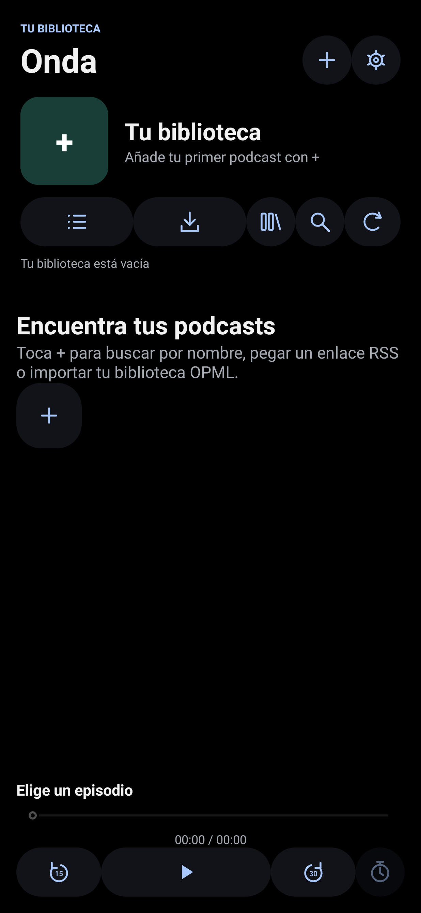 | 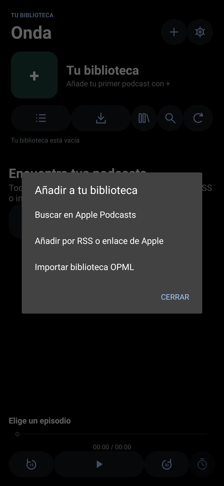 | 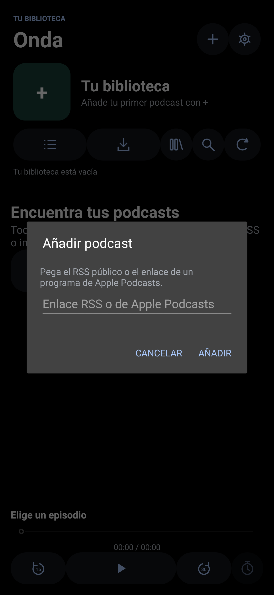 |
| Un espacio para tus programas. | Búsqueda, RSS y bibliotecas OPML. | Pega un RSS o un enlace de Apple. |

| Episodios y vídeo | Organiza tu escucha | Ajustes y calidad |
| :---: | :---: | :---: |
| 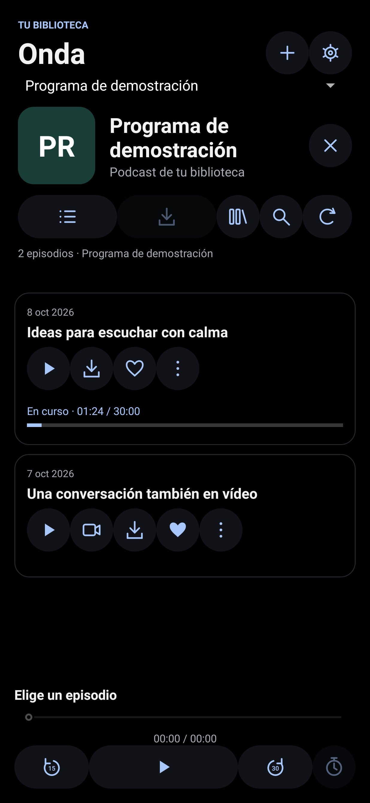 | 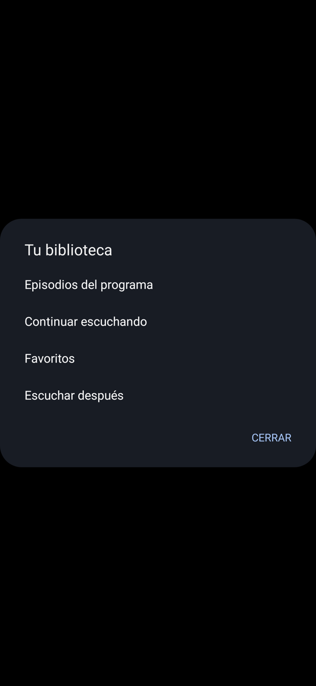 | 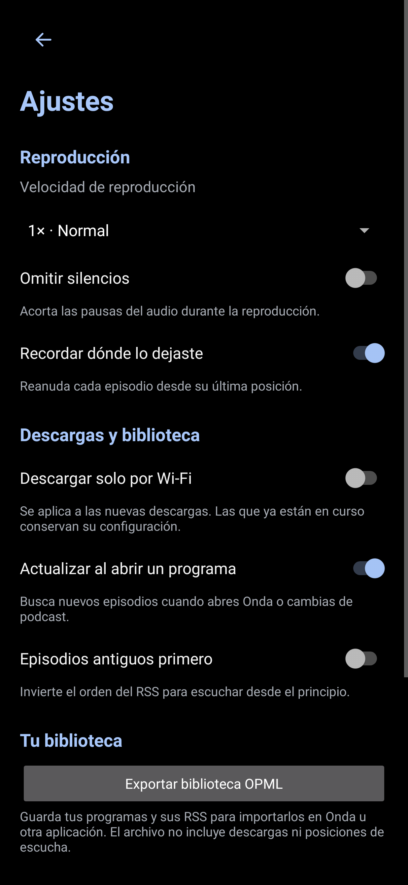 |

| Descargas y avisos | Descubrir | Texto ampliado |
| :---: | :---: | :---: |
| 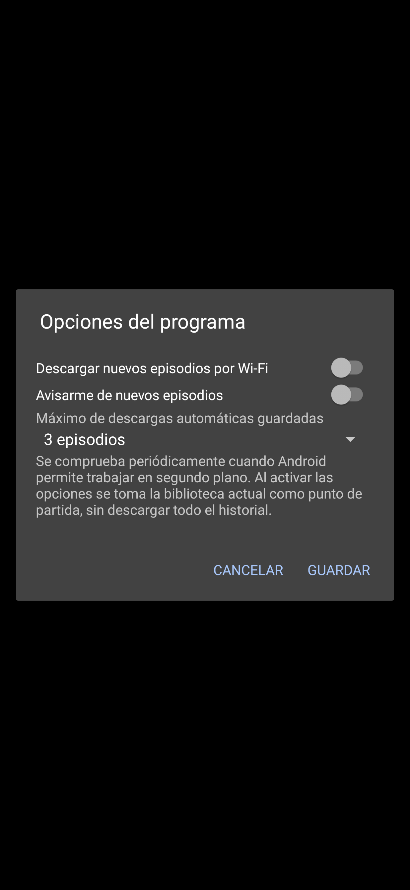 | 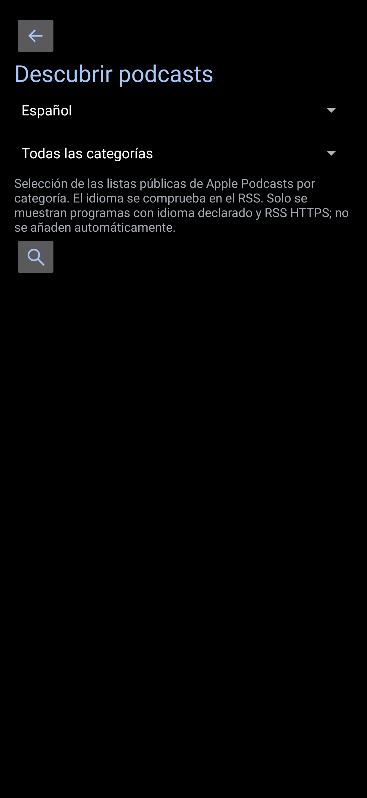 | 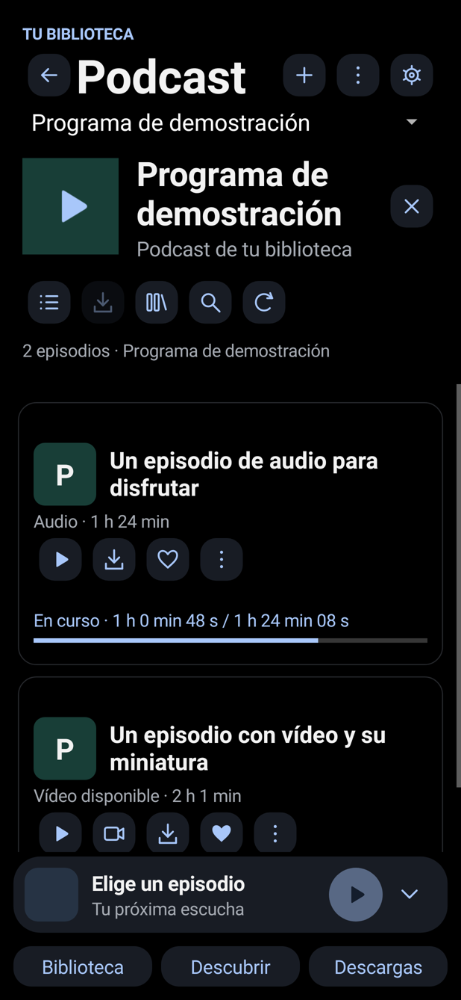 |

<sub>Vistas de la interfaz renderizadas a partir del código de Onda 1.8.1 con una biblioteca vacía o datos de demostración solo para las capturas. Los programas de demostración no se incluyen en la app. La apariencia de los diálogos puede variar según la versión de Android.</sub>

## Qué puedes hacer

| | Función | Para qué sirve |
| :---: | --- | --- |
| 🔎 | **Encuentra tus programas** | Busca por nombre en el catálogo público de Apple Podcasts. |
| 📚 | **Crea tu biblioteca** | Añade RSS HTTPS o enlaces de Apple; importa hasta 100 programas desde OPML y exporta tu biblioteca. |
| 🌙 | **Negro OLED** | Interfaz oscura con fondo negro y controles por iconos. |
| 🎧 | **Escucha en segundo plano** | Reproduce con la pantalla apagada y los controles multimedia de Android. |
| ⬇️ | **Llévalos contigo** | Descarga episodios para escucharlos sin conexión y conserva el progreso. |
| ↔️ | **Controla la escucha** | Configura saltos de 10, 15, 30 o 60 segundos y cambia entre tus programas. |
| ⚙️ | **Ajusta Onda a tu gusto** | Velocidad de 0,75× a 2×, omitir silencios, reanudar, actualizar al abrir y ordenar episodios. |
| 🧭 | **Explora sin interrumpir** | Biblioteca con portadas, pantalla por programa y minirreproductor. |
| 🔖 | **Marcas personales** | Guarda posiciones con nombres por episodio; incluidas en la copia completa. |
| ⏭️ | **Saltos a tu medida** | Tiempos de inicio y final por programa y botones manuales ajustables. |
| 🖼️ | **Reconoce tus programas** | Miniaturas en cada episodio: imagen propia del RSS o logo del programa, con caché local. |
| ⏱️ | **Temporizador para dormir** | Pausa tras 15, 30, 45 o 60 minutos o al terminar el episodio actual. |
| 📤 | **Comparte con Onda** | Recibe un enlace desde otra app y confirma el programa que quieres añadir. |
| 🔊 | **Calidad original** | Reproduce y descarga sin recomprimir. Si el RSS ofrece variantes con calidad indicada, elige la mejor. |
| 🎬 | **Vídeo del podcast** | Abre el reproductor de vídeo cuando el RSS publica un archivo de vídeo compatible. |
| 🗂️ | **Escuchar después** | Cola persistente de hasta 200 episodios, con orden editable y reproducción seguida. |
| ❤️ | **Favoritos y progreso** | Guarda capítulos y encuentra los empezados en Continuar escuchando. |
| ✅ | **Escuchados** | Marca episodios manualmente o al terminarlos y ocúltalos desde Ajustes. |
| 🔍 | **Búsqueda en tu biblioteca** | Encuentra por título los episodios guardados de todos tus programas. |
| 🧹 | **Control del espacio** | Consulta los MB de descargas y elimina archivos individuales o escuchados. |
| ⏳ | **Duración clara** | Duración del RSS en la lista; tiempo transcurrido, total y restante en horas, minutos y segundos. |
| 📥 | **Descargas automáticas** | Activa por programa, solo por Wi-Fi, con límite de 1, 3, 5 o 10 archivos automáticos. |
| 🔔 | **Nuevos episodios** | Avisos opcionales por programa mediante revisión periódica en segundo plano. |
| 💾 | **Copia completa** | Exporta y restaura programas, favoritos, cola, progreso y ajustes en JSON. |
| 🪟 | **Ventana flotante** | Mantiene el vídeo visible al cambiar de aplicación, en dispositivos compatibles. |
| 📑 | **Capítulos** | Lee capítulos Podcasting 2.0 del RSS y salta a su posición. |
| 🌍 | **Descubrir** | Explora listas públicas por categoría y verifica el idioma declarado en el RSS. |
| 🔠 | **Texto ajustable** | Respeta el tamaño del sistema y permite ampliarlo un 15 % o 30 %. |

## Por qué existe Onda

Onda nació de una necesidad sencilla: escuchar en Android los podcasts que seguíamos en Apple Podcasts, sin depender de su versión web.

El proyecto parte de esa idea y busca evolucionar hacia una aplicación independiente para escuchar tus podcasts favoritos, crear tu propia biblioteca y llevar tus episodios contigo, también sin conexión.

Cada persona decide qué programas añadir. **Una instalación nueva no incluye ningún podcast ni ningún audio.** Onda es independiente: no es una aplicación oficial de Apple ni sincroniza tu cuenta de Apple Podcasts.

## Estado de la versión 1.8.1

Este ajuste visual compacta Continuar, Favoritos, Cola y la navegación inferior, con separación entre botones. En el reproductor, velocidad, temporizador y cola tienen más aire; la descarga y el vídeo pasan a acciones secundarias centradas. Los botones conservan una zona de pulsación mínima de 48 dp y mantienen el fondo negro OLED y las formas redondeadas.

La biblioteca muestra tus podcasts en tarjetas con portada. Cada programa abre sus episodios, descripción y opciones. Un minirreproductor permanece visible mientras exploras la biblioteca y otros programas; al tocarlo abre un reproductor completo con portada grande, velocidad visible, temporizador, descargas y cola editable. Descubrir y Descargas se abren desde la navegación inferior.

En el reproductor puedes consultar los capítulos por temas publicados por el editor, ver el capítulo actual y saltar al siguiente. También puedes guardar marcas personales con nombre y volver a ellas. Las marcas y los nuevos ajustes se incluyen en la copia completa.

Desde las opciones del programa puedes omitir un tiempo fijo de inicio y final (0 desactiva; hasta 1800 segundos). El inicio respeta una escucha reanudada y el final solo se omite con duración conocida, conservando el comportamiento de la cola y del temporizador. Si ambos saltos abarcan todo el episodio, se desactivan para ese episodio. No se detectan anuncios automáticamente ni se analiza o envía el audio para transcribirlo. En Ajustes puedes elegir saltos manuales de 10, 15, 30 o 60 segundos y activar o desactivar los colores del sistema en la biblioteca y el reproductor (Android 12 o posterior), con fondo negro OLED.

Las mejoras están disponibles en [**Onda 1.8.1**](https://github.com/ByXuXy88/onda/releases/tag/v1.8.1). Descarga `Onda.apk` e instala sobre Onda 1.5, 1.6, 1.7 o 1.8 sin desinstalarla: se mantienen el paquete y la firma original para conservar biblioteca, favoritos, cola, progreso y descargas.

Las compilaciones de vista previa usan un paquete independiente. La reproducción y el vídeo en ventana flotante aún deben comprobarse en un dispositivo físico.

## Empieza a escuchar

1. Abre la [versión 1.8.1](https://github.com/ByXuXy88/onda/releases/tag/v1.8.1) y descarga **Onda.apk** en la sección **Assets**. Necesitas Android 9 o posterior.
2. Instala y abre Onda. Toca **+** para buscar un programa, pegar su RSS o un enlace de Apple, o importar una biblioteca OPML.
3. Elige un episodio y toca el icono de reproducción. Para escucharlo sin conexión, descárgalo y espera al estado **Disponible sin conexión**.

Toca el engranaje para abrir **Ajustes**. Puedes limitar las nuevas descargas a Wi-Fi y exportar la biblioteca OPML. Las descargas no usan itinerancia. El temporizador está junto a los controles del reproductor. El icono de biblioteca abre **Continuar escuchando**, **Favoritos** y **Escuchar después**; la lupa busca episodios guardados. Usa los tres puntos de cada episodio para marcarlo como escuchado, añadirlo a la cola o cambiar su orden.

Si aparece la cámara, el episodio dispone de vídeo. Al cerrar su pantalla, la reproducción sigue en segundo plano. Cuando hay audio y vídeo separados, el botón de descarga guarda el audio; en podcasts solo de vídeo guarda ese archivo de vídeo.

Para las novedades de 1.6, abre **Opciones de este programa** (tres puntos junto al título) o **Ajustes → Opciones de cada programa**. Las descargas y los avisos empiezan desde el estado actual del RSS, sin descargar el historial. Android determina cuándo se ejecuta la revisión de unas seis horas; no son avisos instantáneos. El límite solo gestiona descargas automáticas y conserva las manuales y el episodio activo. El borrado de escuchados se activa aparte.

En **Ajustes** puedes guardar o restaurar una copia completa JSON mediante el selector de archivos de Android. La restauración sustituye el estado portátil tras comprobar el archivo y pedir confirmación, detiene la reproducción y conserva las descargas de ese dispositivo. Los archivos multimedia no forman parte de la copia.

En vídeo, usa la ventana flotante o pulsa Inicio mientras reproduces. La duración publicada y los capítulos dependen del RSS; si no publica duración, se aprende al reproducir. Los capítulos compatibles usan `podcast:chapters` con JSON HTTPS. La búsqueda por idioma revisa hasta 12 RSS de candidatos y excluye programas sin idioma declarado.

Las portadas de programas añadidos en versiones anteriores se recuperan al actualizar sus episodios. Si desactivas la actualización automática, usa el botón de actualizar.

Desde Ajustes puedes abrir la web de Apple Podcasts para consultar allí tu cuenta. **Iniciar sesión en la web de Apple no importa ni sincroniza su biblioteca con Onda.**

## Para desarrolladores

<details>
<summary><strong>Compilar, distribuir y conocer los límites actuales</strong></summary>

### Compilar

Necesitas JDK 17, Android SDK 35 y Build Tools 35.0.0. Define `ANDROID_HOME`, o crea un `local.properties` con la ruta de tu SDK:

```properties
sdk.dir=/ruta/a/android-sdk
```

En Linux/macOS:

```sh
sh ./gradlew assembleDebug testDebugUnitTest lintDebug
```

En Windows usa `gradlew.bat`. El APK aparece en `app/build/outputs/apk/debug/app-debug.apk`; las compilaciones debug son vistas previas con paquete separado y nombre Onda · Vista previa.

### Firma para distribución

No hay claves de firma en el repositorio. Las compilaciones debug sin configuración usan la clave local de desarrollo de Android. Los APK de ejecuciones independientes de GitHub pueden tener firmas distintas y no sirven como actualizaciones entre sí.

Para publicar actualizaciones, usa una clave privada estable que controles y mantenla fuera del repositorio. El proyecto admite estas variables de entorno:

- `ONDA_KEYSTORE_PATH`: ruta absoluta al archivo de firma.
- `ONDA_KEYSTORE_PASSWORD`: contraseña del almacén.
- `ONDA_KEY_ALIAS`: alias de la clave.
- `ONDA_KEY_PASSWORD`: contraseña de la clave.

Con esas variables configuradas, `sh ./gradlew assembleRelease` genera `app/build/outputs/apk/release/app-release.apk`. Conserva la misma clave para las versiones siguientes. Las versiones personales hasta 1.5 comparten la firma original. Onda 1.6, 1.7 y 1.8.1 mantienen esa misma firma original. La clave se conserva fuera del repositorio público.

### Biblioteca vacía y actualización

Una instalación limpia empieza vacía y no consulta fuentes RSS al arrancar. Una actualización conserva los programas ya guardados por el usuario. Se mantiene una migración para instalaciones personales anteriores que ya tenían AM en caché; nunca añade AM en una instalación nueva. Los episodios y podcasts usados en pruebas no se empaquetan en la aplicación.

### Límites actuales

La calidad depende del original del editor y de los decodificadores del dispositivo: no se convierte un MP3 en audio sin pérdidas ni se aumenta artificialmente su calidad. Las variantes RSS se seleccionan por el bitrate indicado o, para vídeo sin bitrate, por su altura; sin esos datos se conserva la primera variante válida. El soporte de vídeo se dirige a archivos RSS como MP4 y WebM con formatos compatibles. No importa vídeos desde páginas de YouTube ni incluye módulos para emisiones HLS/DASH o contenido protegido.

La cola guarda episodios pendientes, no inicia la escucha sola al abrir la app y continúa al terminar el episodio actual. Favoritos, cola y estado de escuchado son locales y todavía no se incluyen en la exportación OPML. La búsqueda utiliza los episodios ya guardados; actualiza un programa si quieres incluir sus capítulos nuevos.

La búsqueda depende del catálogo público de Apple y filtra programas sin RSS HTTPS disponible. No sincroniza cuentas de Apple Podcasts, compras ni historial de otros servicios. La importación OPML guarda la lista de programas; los episodios se cargan al seleccionarlos. La biblioteca y el progreso son locales. La exportación OPML solo incluye los programas y sus RSS, sin audio ni posiciones de reproducción.

El vídeo, la reproducción seguida, el funcionamiento con pantalla apagada y las descargas deben verificarse también en dispositivos reales. Las pruebas automatizadas cubren el estado inicial vacío, la biblioteca, la importación, la búsqueda, el progreso, las portadas, los ajustes, el temporizador en el servicio, las variantes de audio/vídeo, la cola, los favoritos y la compatibilidad con datos anteriores.


</details>

## Privacidad y licencia

[Privacidad](PRIVACY.md) · [Licencia MIT](LICENSE) · [Cómo contribuir](CONTRIBUTING.md) · [Bibliotecas utilizadas](THIRD_PARTY_NOTICES.md)

Los podcasts y sus derechos pertenecen a sus respectivos editores. Onda no es una aplicación oficial de Apple o Google.

## Inspiración y créditos

Algunos elementos visuales de los controles de reproducción de Onda están inspirados en [Phonograph Plus](https://github.com/chr56/Phonograph_Plus), especialmente su estilo Material. El resto del diseño y las funciones de Onda se han desarrollado de forma independiente. Gracias a chr56 y a quienes contribuyen al proyecto. Esta adaptación utiliza controles propios y no incorpora código ni recursos de Phonograph Plus.
